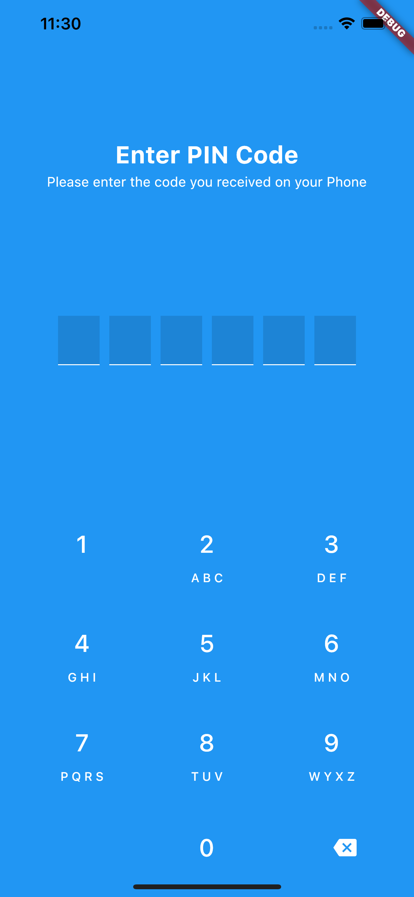
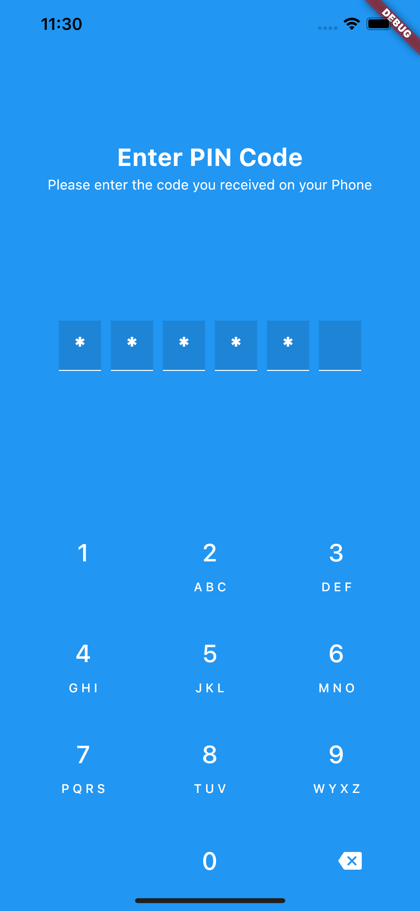

# pin_code_view

A beautiful looking pin_code_view for flutter apps, customizable and fluid.
Pull requests are always welcomed.

.
.

## Features

1. Code length customization
2. On Screen keyboard
3. Keyboard type customization

## Installation

In the `dependencies:` section of your `pubspec.yaml`, add the following line:

```yaml
pin_code_view: 0.3.0+1
```

## Usage

```dart
import 'package:pin_code_view/pin_code_view.dart';

class MyWidget extends StatelessWidget {
  Widget build(BuildContext context) {
    return PinCode(
      title: "Enter PIN Code",
      subtitle: "Please enter the code you received on your Phone",
      onChange: (String code) {
        print(code);
      },
      obscurePin: true,
    );
  }
}
```
